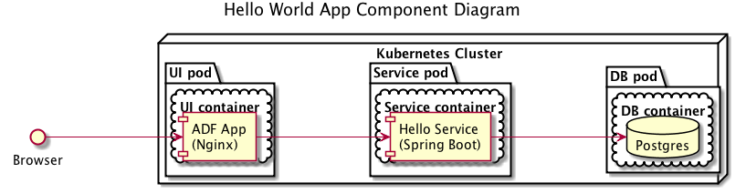
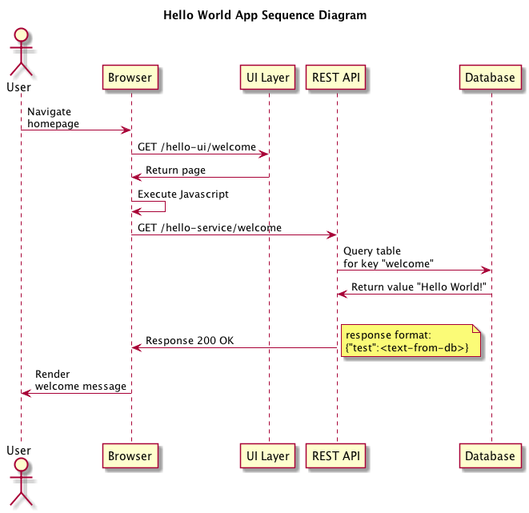
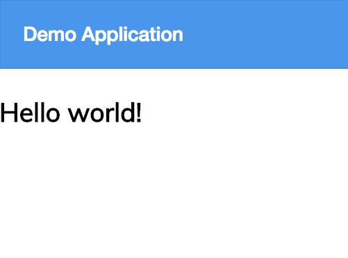
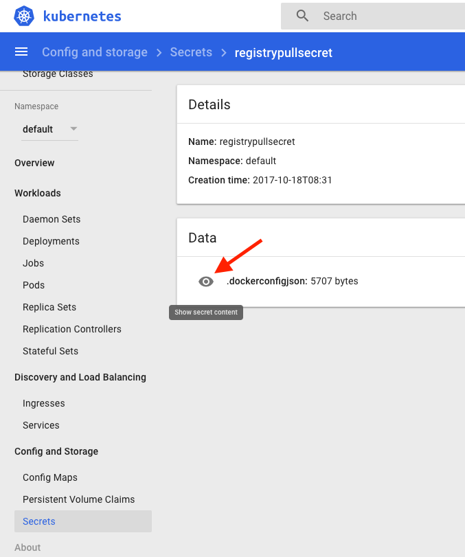

# Hello World Example

To get familiar with how an Alfresco Engineer or a Solution Developer can build and use a deployment package for Kubernetes 
we have created a simple hello world app that you can use for reference as you get started.

The application consists of several components:
* Database
	* To store the data, [postgres](https://github.com/kubernetes/charts/tree/master/stable/postgresql) in our case
* [Backend REST Service](https://github.com/Alfresco/alfresco-anaxes-hello-world-service)
	* To Create/Read/Update/Delete entries in the db
* [Backend REST Service Deployment](https://github.com/Alfresco/alfresco-anaxes-hello-world-service-deployment)
	* For creating Docker images and Helm charts for the service
* [Frontend UI](https://github.com/Alfresco/alfresco-anaxes-hello-world-ui)
	* As the interface to the backend service
* [Frontend UI Deployment](https://github.com/Alfresco/alfresco-anaxes-hello-world-ui-deployment)
	* For creating Docker images and Helm charts for the UI

The components, how they are packaged and deployed is shown in the diagram below:



The interactions between the components is shown in the following diagram:



## How to Deploy

1. Create the namespace and secrets based on the instruction provided in [SECRETS.md](https://github.com/Alfresco/alfresco-anaxes-shipyard/blob/master/SECRETS.md)
   and set its name as an environment variable:
   
   ```bash
   export DESIREDNAMESPACE=example
   ```

2. As part of the infrastucture pull the ingress chart to the namespace
    ```bash
    helm repo update
    
    cat <<EOF > ingressvalues.yaml
    rbac:
      create: true
    controller:
      config:
        ssl-redirect: "false"
      scope:
        enabled: true
        namespace: $DESIREDNAMESPACE
    EOF
    
    helm install stable/nginx-ingress --version=0.12.3 -f ingressvalues.yaml \
    --namespace $DESIREDNAMESPACE
    ```
    
    <details>
    <summary>Optional</summary>
    <p>
    
    If you want your own certificate set here you should create a secret from your cert files:
    
    ```bash
    kubectl create secret tls certsecret --key /tmp/tls.key --cert /tmp/tls.crt --namespace $DESIREDNAMESPACE
    ```
    
    Then deploy the ingress with following settings
    ```bash
    cat <<EOF > ingressvalues.yaml
    rbac:
      create: true
    controller:
      config:
        ssl-redirect: "false"
      scope:
        enabled: true
        namespace: $DESIREDNAMESPACE
      publishService:
        enabled: true
      extraArgs:
        default-ssl-certificate: $DESIREDNAMESPACE/certsecret
    EOF
    
    helm install stable/nginx-ingress --version=0.12.3 -f ingressvalues.yaml \
    --namespace $DESIREDNAMESPACE
    ```
    
    Or you can add an AWS generated certificate if you want and autogenerate a route53 entry
    
    ```bash
    cat <<EOF > ingressvalues.yaml
    rbac:
      create: true
    controller:
      config:
        ssl-redirect: "false"
      scope:
        enabled: true
        namespace: $DESIREDNAMESPACE
      publishService:
        enabled: true
      service:
        targetPorts:
          https: 80
        annotations:
          service.beta.kubernetes.io/aws-load-balancer-ssl-cert: #sslcert ARN -> https://github.com/kubernetes/kubernetes/blob/master/pkg/cloudprovider/providers/aws/aws.go
          service.beta.kubernetes.io/aws-load-balancer-ssl-ports: https
          # External dns will help you autogenerate an entry in route53 for your cluster. More info here -> https://github.com/kubernetes-incubator/external-dns
          external-dns.alpha.kubernetes.io/hostname: $DESIREDNAMESPACE.YourDNSZone
    EOF
    
    helm install stable/nginx-ingress --version=0.12.3 -f ingressvalues.yaml \
    --namespace $DESIREDNAMESPACE
    ```
    </p>
    </details>
    <br/>

3. Get the nginx-ingress-controller release name from the previous command and set it as a variable:
    ```bash
    export INGRESSRELEASE=knobby-wolf
    ```

4. Add the helm repository so that chart dependencies can be pulled:
    ```bash
    helm repo add alfresco-incubator http://kubernetes-charts.alfresco.com/incubator
    ```

5. Deploy the helm chart in your namespace.
    ```bash
    helm install alfresco-incubator/hello-world-app --namespace $DESIREDNAMESPACE
    ```
    Keep in mind that when running on AWS the app will trigger Kubernetes to generate an Elastic Load Balancer providing 
    access to the application and service, so you will probably have to wait a bit until it gets created and you can access 
    the application.

6. Check that the deployment worked by running the command below:

    ```bash
    kubectl get pods --namespace $DESIREDNAMESPACE
    ```

    You should see output something similar to below. The first time you deploy the status column will say <code>ContainerCreating</code> for a while as it needs to download the docker image. If the status column shows an error take a look at the Troubleshooting section.

    ```
    NAME                                                       READY     STATUS    RESTARTS   AGE
    your-bison-hello-world-app-backend-433440179-bd31c         1/1       Running   0          37m
    your-bison-hello-world-app-ui-4187005864-wl4bx             1/1       Running   0          37m
    your-bison-nginx-ingress-controller-289934240-f2sh1        1/1       Running   0          37m
    your-bison-nginx-ingress-default-backend-714929657-7ds77   1/1       Running   0          37m
    your-bison-postgresql-400070053-8mxpw                      1/1       Running   0          37m
    ```

## Accessing the UI

1. Run the following command to get url for UI

    ```bash
    echo "http://$(kubectl get services $INGRESSRELEASE-nginx-ingress-controller -o jsonpath={.status.loadBalancer.ingress[0].hostname} --namespace $DESIREDNAMESPACE)/hello-ui/welcome"
    ```

2. Navigate to the returned URL to use the UI. The screenshot below shows what you should see.

    

3. To access different keys in the db just change "welcome" to the key you've created and you should be able to see the value set for that key.
Check out the next steps to find out how you can create a new key.

## Accessing the REST API

1. Run the following command to get service 

    ```bash
    echo "http://$(kubectl get services $INGRESSRELEASE-nginx-ingress-controller -o jsonpath={.status.loadBalancer.ingress[0].hostname} --namespace $DESIREDNAMESPACE)/hello-service/hello/"
    ```

2. Use the following curl command to test the REST API.

    ```bash
    curl [url-from-step-1]/welcome
    ```

    You should see the following output:

    ```
    {"key":"welcome","value":"Hello World!"}
    ```

3. To create a new key through the service use the following curl:

    ```bash
    curl -H "Content-Type: application/json" -d '{"key":"new-test-data","value":"Test 1,2,3"}' [url-from-step-1]
    ```

4. To access different keys in the db just change "welcome" to the key you've created and you should be able to see the value set for that key.

    ```bash
    curl [url-from-step-1]/new-test-data
    ```
For more examples on using the hello service you can import the [postman collection](https://github.com/Alfresco/alfresco-anaxes-hello-world-service/blob/master/src/test/postman/hello-service-test-collection.json) 
into the [Postman app](https://www.getpostman.com/docs/) and use it there.

## Cleaning Up

1. Run the following command to get a list of your releases:

    ```bash
    helm ls --namespace $DESIREDNAMESPACE
    ```

2. Run the command below with the appropriate release name to uninstall the deployment and the ingress controller:

    ```bash
    helm delete --purge [release-name] $INGRESSRELEASE
    ```

3. Ensure everything has been removed by running the following command:

    ```bash
    helm status [release-name]
    ```

    You should see the following output:

    ```
    LAST DEPLOYED: Thu Nov  2 12:16:56 2017
    NAMESPACE: example
    STATUS: DELETED
    ```

4. Delete the namespace.

    ```bash
    kubectl delete namespace $DESIREDNAMESPACE
    ```

## Troubleshooting

If the deployment is not working correctly list the pods by executing:
    
```bash
kubectl get pods --namespace $DESIREDNAMESPACE
```

If a pod is showing an error in the Status column run the following command to get more detailed information:

```bash
kubectl describe pod <pod-name> --namespace $DESIREDNAMESPACE
```

If the events indicate there is a problem fetching the docker image check that the secret created in the Deploy section 
contains credentials. The easiest way to do this is to use the Kubernetes dashboard as shown in the screenshot below. 
Click the eye icon to see the secret contents.



To get to the dashboard type `kubectl proxy` and then navigate to `http://localhost:8081/ui` in a browser.

If the credentials are missing check they are present in `~/.docker/config.json`, especially if you're running on a Mac 
as the "Securely store docker logins in macOS keychain" preference may be enabled by default.

If you get a response of `http://` from the `get-ui-url.sh` or `get-backend-url.sh` 
when deploying to a cluster on AWS, it likely means the Elastic Load Balancer for the service failed to create successfully. 
This can sometimes happen due to limits in your AWS account.
